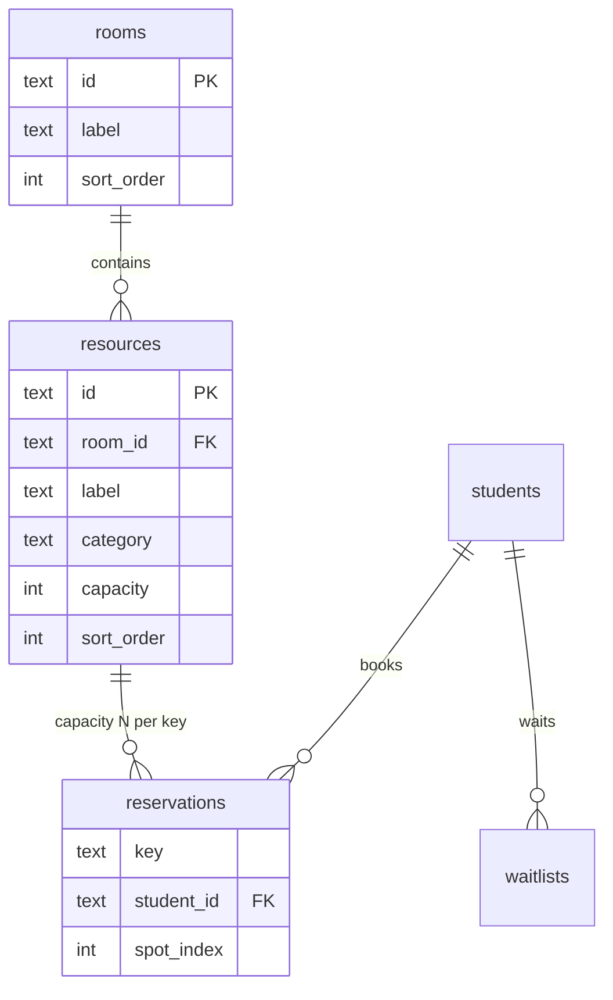

# Feature: Kinsal Platform v2

## Status: Requirements

## Problem Statement

Kinsal v1 supports a fixed set of pottery wheels with one student per wheel per time slot. Salma's studio also runs **tables** with **2–5 editable seats** each (hand-building, clay prep, and glaze work), organized into **custom rooms** the instructor can rename and reorder. The app needs a unified booking model (wheels + categorized tables), full instructor control over rooms/resources/categories/seat counts, and a phased rollout of studio operations features.

Without v2, the instructor cannot represent table capacity, group equipment by room, or grow the product beyond three hardcoded wheels.

## Target Users

- **Students (studio members):** Book a wheel or a spot at any table type during open booking windows; see category labels (wheel, hand building, clay prep, glaze); join waitlists; receive emails.
- **Instructor (Salma):** Create and rename **rooms**; add/edit/remove **resources**; set **category** (wheel vs table type); set **seat count** per table (2–5); manage roster, schedule, closures, PIN, exports.

## User Stories

### Phase 1 — Rooms, resources, tables
- As an **instructor**, I want to **create, rename, reorder, and remove rooms** with custom names so the grid matches my studio layout.
- As an **instructor**, I want to add **wheels** (always 1 seat) and **tables** with **editable seat counts (2–5)** so capacity matches each physical table.
- As an **instructor**, I want to set each resource **category** — **wheel**, **hand-building table**, **clay prep table**, or **glaze table** — and change it later so the grid and emails use the right label.
- As an **instructor**, I want to **move a resource between rooms** or rename it without breaking existing bookings.
- As a **student**, I want to **book a table** without picking a seat number so that booking stays simple.
- As a **student**, I want to see the **table category** and **"2 of 5 spots left"** so I know what I am booking and what is available.

### Phase 2 — Editable schedule
- As an **instructor**, I want to edit **studio days**, **slot times**, and **booking window rules** without code changes.
- As an **instructor**, I want to set the **studio timezone** so that booking windows match local time.

### Phase 3 — Student authentication
- As a **student**, I want to sign in with a **magic link** so that only I can book under my email.
- As the **system**, I must **reject bookings** where the client-supplied student id does not match the authenticated user.

### Phase 4 — Student experience
- As a **student**, I want a **confirmation email** when I book so that I have a record.
- As a **student**, I want a **reminder email** before my session so that I am less likely to no-show.
- As a **student**, I want to see **my upcoming bookings** and **leave a waitlist** without contacting the instructor.
- As a **student**, I want to **add a booking to my calendar** (.ics) so that I do not forget.

### Phase 5 — Instructor operations
- As an **instructor**, I want to **block a resource or slot** for maintenance so students cannot book it.
- As an **instructor**, I want to mark **studio closed days** so the grid reflects holidays.
- As an **instructor**, I want to **limit bookings per student per week** and **block repeat no-shows** until I clear them.
- As an **instructor**, I want to **import/export roster and bookings** as CSV.
- As an **instructor**, I want to **change my PIN in the app** without opening Supabase.
- As an **instructor**, I want a **server-side audit log** so actions are recorded beyond the browser session log.

### Phase 6 — Communications
- As an **instructor**, I want to **edit email templates** for waitlist, confirmation, and reminders.
- As an **instructor**, I want to **broadcast an email** to the roster (e.g. "studio closed Saturday").
- As a **student**, I may **opt in to SMS** for urgent notifications (optional, Twilio).

### Phase 7 — Polish and security
- As the **system**, I want **CORS restricted** to GitHub Pages and Pixiset origins.
- As a **student on mobile**, I want the **iframe to size correctly** in Pixiset.
- As a **user**, I want clear **loading and offline errors** when Supabase is unreachable.

---

## Confirmed product decisions

| Decision | Choice | Rationale |
|----------|--------|-----------|
| Table booking | **Table-level** — student books the table; server assigns spot | Simpler UX; user confirmed |
| Rooms | **Fully editable** — custom names, add/reorder/remove; organizational grouping only | User request; no room-level capacity |
| Resource categories | **wheel**, **hand_build_table**, **clay_prep_table**, **glaze_table** | User request; shown on grid and in Settings |
| Table seats | **Instructor sets 2–5 per table**; editable anytime (if no overbooking) | User request |
| Wheel seats | **Always 1** — locked when category is wheel | Wheels are single-student |
| Category change | **Allowed** — wheel ↔ table types; capacity auto-adjusts (wheel→1, table→default 4) | User request |
| One booking per day | **Yes** — one reservation per student per calendar day across **all** resources | Matches v1 rule |
| Max resources | **20** combined | Enforced server-side |
| Default room (migration) | **"Main studio"** (`id: main-studio`) | Existing wheels map here |
| Student spot picker | **Out of scope** | Table-level booking only |
| SMS | **Optional Phase 6**; email-first | Cost and complexity |

---

## Acceptance Criteria (platform-wide)

- [ ] Instructor can CRUD **rooms** (custom names, reorder) from Settings without code deploy.
- [ ] Instructor can CRUD **resources** with **category** (wheel / hand building / clay prep / glaze) and **editable seat count** (2–5 for tables, 1 for wheels).
- [ ] Instructor can **change category** on an existing resource (e.g. re-label a table as glaze table) without breaking reservation keys.
- [ ] Student grid is grouped by room; each row shows **category badge** + capacity (e.g. "Clay prep · 3 of 5 spots left").
- [ ] Sixth booking on a 5-spot table fails with a clear error; waitlist works per resource key.
- [ ] Existing wheel reservations continue to work after migration (`wheels` → `resources`).
- [ ] All writes require edge functions; anon key cannot insert/update/delete protected tables.
- [ ] Magic link login (Phase 3) prevents booking as another roster member.
- [ ] Confirmation + reminder emails send via Resend (Phase 4).
- [ ] Blocked slots and closed days prevent booking server-side (Phase 5).
- [ ] CORS allows only approved origins (Phase 7).

---

## Data Model

### Entity relationship



### Core types (v2)

```typescript
// supabase/functions/_shared/types/domain.ts

export interface Room {
  id: string;           // slug: main-studio, annex (stable; label is editable)
  label: string;        // display: "Main studio" — instructor custom name
  sort_order: number;
}

/** All bookable studio equipment categories */
export type ResourceCategory =
  | "wheel"
  | "hand_build_table"
  | "clay_prep_table"
  | "glaze_table";

export const CATEGORY_LABELS: Record<ResourceCategory, string> = {
  wheel: "wheel",
  hand_build_table: "hand building",
  clay_prep_table: "clay prep",
  glaze_table: "glaze",
};

export function isWheelCategory(c: ResourceCategory): boolean {
  return c === "wheel";
}

export interface Resource {
  id: string;           // slug: shimpo, table-a (stable across renames)
  room_id: string;
  label: string;        // display name: "Table A", "Shimpo"
  category: ResourceCategory;
  capacity: number;     // 1 for wheel; 2–5 for all table categories
  sort_order: number;
}

export interface Reservation {
  key: string;          // Tuesday|am|table-a
  student_id: string;
  spot_index: number | null;  // 1..capacity; assigned on book
}

export interface WaitlistEntry {
  key: string;
  student_id: string;
  position: number;
}

// Phase 2
export interface ScheduleSlot {
  id: string;           // am, pm
  label: string;
  start_hour: number;
  end_hour: number;
  open_offset_minutes: number;   // default -120 (2h before start)
  close_offset_minutes: number;  // default -60 (1h before end)
}

export interface StudioDay {
  weekday: string;      // Tuesday, Thursday, ...
  sort_order: number;
}

export interface StudioSettings {
  timezone: string;     // America/New_York
}

// Phase 5
export interface SlotBlock {
  key: string;          // optional partial key e.g. Tuesday|am|table-a
  reason: string | null;
  blocked_until: string | null;
}

export interface ClosedDay {
  date: string;         // YYYY-MM-DD
  reason: string | null;
}

export interface AuditLogEntry {
  id: string;
  actor: "instructor" | "system" | "student";
  action: string;
  detail: string;
  created_at: string;
}
```

### Zod schemas (examples)

```typescript
import { z } from "https://deno.land/x/zod@v3.22.4/mod.ts";

export const resourceCategorySchema = z.enum([
  "wheel",
  "hand_build_table",
  "clay_prep_table",
  "glaze_table",
]);

export const resourceSchema = z.object({
  id: z.string().optional(),
  room_id: z.string().min(1),
  label: z.string().min(2).max(40),
  category: resourceCategorySchema,
  capacity: z.number().int().min(1).max(5),
}).refine(
  (r) => isWheelCategory(r.category)
    ? r.capacity === 1
    : r.capacity >= 2 && r.capacity <= 5,
  { message: "Wheels must have 1 seat; tables must have 2–5 seats" },
);

export const roomSchema = z.object({
  id: z.string().optional(),
  label: z.string().min(2).max(40),
  sort_order: z.number().int().min(0),
});

export const saveResourcesSchema = z.object({
  action: z.literal("saveResources"),
  token: z.string(),
  resources: z.string(), // JSON array of resourceSchema
});
```

---

## Phase 1 — Rooms, resources, and tables (detailed spec)

### Problem

v1 `wheels` table models only single-spot pottery wheels. The studio needs **multi-seat tables** (hand building, clay prep, glaze), **custom editable rooms**, and **per-resource category + seat count** the instructor controls from Settings.

### Resource categories

| Category | DB value | Seats | Student-facing label |
|----------|----------|-------|----------------------|
| Pottery wheel | `wheel` | 1 (fixed) | "wheel" |
| Hand-building table | `hand_build_table` | 2–5 (editable) | "hand building" |
| Clay prep table | `clay_prep_table` | 2–5 (editable) | "clay prep" |
| Glaze table | `glaze_table` | 2–5 (editable) | "glaze" |

Booking rules are identical for all table categories — only the **label/badge** differs. Category does not change capacity logic or waitlist behavior.

### Database migration (`supabase/migrations/resources-rooms.sql`)

1. Create `rooms` table (`id`, `label`, `sort_order`); seed `main-studio` → "Main studio".
2. Create `resources` table with FK to `rooms` and column `category text not null`.
3. Migrate `wheels` rows → `resources` (`category: wheel`, `capacity: 1`, `room_id: main-studio`); preserve `id` slugs.
4. Add `spot_index int` to `reservations` (nullable; backfill 1 for existing rows).
5. Add unique constraint on `(key, spot_index)` per reservation key.
6. RLS: anon SELECT on `rooms`, `resources`; no anon writes.
7. Drop or deprecate `wheels` table after verification.

**Check constraint (optional):**

```sql
alter table resources add constraint resources_category_check
  check (category in ('wheel','hand_build_table','clay_prep_table','glaze_table'));

alter table resources add constraint resources_capacity_check
  check (
    (category = 'wheel' and capacity = 1)
    or (category != 'wheel' and capacity between 2 and 5)
  );
```

### Booking logic (`manage-booking`)

For action `book`:

1. Validate `day`, `slotId`, `resourceId` against schedule (Phase 2) and resource exists.
2. Build `key = ${day}|${slotId}|${resourceId}`.
3. Enforce **one booking per student per day** (any key starting with `${day}|`).
4. Count reservations where `key = k`.
5. If `count >= resource.capacity` → 409 "that slot is full".
6. Assign `spot_index` = lowest integer in `1..capacity` not already used for `k`.
7. Insert `{ key, student_id, spot_index }`.

### Waitlist behavior (unchanged semantics, per resource key)

- Waitlist key = same `Tuesday|am|table-a` (category-agnostic).
- When a spot frees, promote **one** waitlisted student into **one** spot.

For action `cancel`:

1. Verify reservation row belongs to student (delete their row for that key).
2. If table had multiple spots, only remove that student's row; do not shift spot_index of others.
3. Run `promoteAndNotify` if waitlist exists (promotes **one** student into freed spot).

For display (student grid):

- **Wheel:** show `"{label} (wheel)"` — student name if booked, else "available" + [reserve].
- **Any table category:** show `"{label} ({category label})"` + `"${booked} of ${capacity} seats"`; if full, waitlist UI.
- Optional **category badge** color/icon per type (Phase 7 polish).

### Instructor Settings UI — Rooms & resources

Fully replaces v1 "Wheels" section. All changes saved via `saveRooms` / `saveResources`.

**Rooms panel** — custom names, full CRUD:

```
┌─ Rooms ──────────────────────────────────────────────┐
│  Name              Order                             │
│  [Main studio    ]  [↑][↓]  [remove]               │
│  [Glaze room     ]  [↑][↓]  [remove]               │
│  [+ Add room]                                        │
│  [Save rooms]                                        │
└──────────────────────────────────────────────────────┘
```

- Room **label** is free text (2–40 chars); **id** slug generated on create and never shown to instructor.
- Cannot remove a room that still has resources (must move or delete resources first).

**Resources panel** — per room:

```
┌─ Resources in: Main studio ──────────────────────────┐
│  Name          Category              Seats   Actions │
│  [Shimpo    ]  [Wheel            ▼]  1      [remove]│
│  [Table A   ]  [Hand-building tbl ▼] [4 ▼]   [remove]│
│  [Table B   ]  [Clay prep table  ▼]  [3 ▼]   [remove]│
│  [Table C   ]  [Glaze table      ▼]  [2 ▼]   [remove]│
│  [+ Add resource]                                    │
│  [Save resources]                                    │
└──────────────────────────────────────────────────────┘
```

**Category dropdown options:**
- Wheel
- Hand-building table
- Clay prep table
- Glaze table

**Behavior when category changes:**
| From | To | Capacity behavior |
|------|-----|-------------------|
| Wheel | Any table | Capacity defaults to **4**; instructor can adjust 2–5 before save |
| Any table | Wheel | Capacity forced to **1** |
| Table → table | — | Capacity unchanged unless instructor edits seats |

**Seat count (tables only):**
- Dropdown or number input: **2, 3, 4, 5**
- Cannot reduce seats below **current bookings** for any upcoming slot (server rejects save with clear error)
- Wheels: seats field disabled/read-only at 1

**Move resource between rooms:** dropdown "Room" on each resource row, or drag between room sections (optional Phase 7).

Validation client-side mirrors server: max 20 resources, max 10 rooms, unique resource labels studio-wide, unique room labels.

### admin-action API (Phase 1)

| Action | Body | Response |
|--------|------|----------|
| `getRooms` | `{ token }` | `{ success, rooms[] }` |
| `saveRooms` | `{ token, rooms: JSON }` | `{ success, rooms[] }` |
| `getResources` | `{ token }` | `{ success, resources[] }` |
| `saveResources` | `{ token, resources: JSON }` | `{ success, resources[] }` |

`saveWheels` deprecated; frontend calls `saveResources` only.

### Frontend data loading

```javascript
async function loadRooms() {
  const { data } = await db.from('rooms').select('*').order('sort_order');
  rooms = data || [];
}
async function loadResources() {
  const { data } = await db.from('resources').select('*').order('sort_order');
  resources = data || [];
  // Group by room_id for render
}
```

Replace `loadWheels()` / `wheels` array with `loadResources()` / `resources` grouped by room.

### UI mockup — student grid

```
── Main studio ──────────────────────────────

morning · 9:00 am – 1:00 pm                    [open]

  Shimpo · wheel
    available                          [reserve]

  Pacifica · wheel
    Jane Doe                           (booked)

  Table A · hand building
    2 of 4 seats · waitlist: 1         [reserve] [join waitlist]

  Prep table · clay prep
    1 of 3 seats                       [reserve]

── Glaze room ───────────────────────────────

  Glaze table · glaze
    5 of 5 seats · full                waitlist: 2
```

### Phase 1 acceptance criteria

- [ ] Instructor creates room "Glaze room" with custom name; grid shows new section header.
- [ ] Instructor renames "Main studio" to another label; grid header updates after save.
- [ ] Three migrated wheels appear under Main studio with existing bookings intact.
- [ ] Instructor adds clay prep table with **3 seats**; grid shows "clay prep · X of 3 seats".
- [ ] Instructor changes Table A from hand-building to **glaze table**; badge updates; bookings unchanged.
- [ ] Instructor increases seats 3→5 on empty table; save succeeds.
- [ ] Instructor tries to reduce seats 5→3 while 4 booked → save rejected with error.
- [ ] Five students book same table key; sixth gets "slot is full".
- [ ] Wheel still allows only one booking per key.
- [ ] Removing a resource or room with active bookings returns error.

---

## Phase 2 — Editable schedule

### Scope

- Tables: `studio_days`, `schedule_slots`, `studio_settings` (timezone, booking offsets).
- Replace hardcoded `DAYS`, `SLOTS`, `America/New_York` in `index.html` and `manage-booking`.
- Instructor Settings: "Schedule" section.

### Acceptance criteria

- [ ] Changing Tuesday to Wednesday in settings updates grid tabs after save.
- [ ] Booking window enforced server-side using configured offsets and timezone.
- [ ] Invalid schedule (overlapping slots) rejected on save.

---

## Phase 3 — Student authentication (magic link)

### Scope

- Link `students.id` to Supabase Auth `user_id` (nullable until first login).
- Login flow: enter email → send magic link → return to app with session.
- `manage-booking`: derive `studentId` from JWT, ignore client-supplied id for writes.

### Acceptance criteria

- [ ] Unauthenticated book attempt returns 401.
- [ ] Student A cannot cancel Student B's reservation.
- [ ] Roster email not in Auth still uses lookup + link-on-first-login or invite flow.

---

## Phase 4 — Student experience

### Scope

- `myBookings` view in student dashboard.
- `leave_waitlist` action in `manage-booking`.
- `sendBookingConfirmation` in Resend on successful book.
- Cron job `send-reminders` (day-before or 2h-before; configurable in Phase 6 templates).
- `.ics` download endpoint or client-generated ICS from booking data.

### Acceptance criteria

- [ ] Confirmation email received within 1 minute of booking.
- [ ] Reminder sent for tomorrow's bookings per cron schedule.
- [ ] ICS file opens in Google Calendar / Apple Calendar.

---

## Phase 5 — Instructor operations

### Scope

- `slot_blocks`, `closed_days` tables.
- Weekly per-student booking cap (configurable default).
- No-show threshold → `students.booking_blocked_until` or flag; instructor clears in roster.
- CSV import (name, email columns) and export (roster, reservations).
- `changePin` admin action updates `PIN_HASH` secret via Supabase Management API or stored hash table.
- `audit_log` table; admin actions write entries.

### Acceptance criteria

- [ ] Blocked resource shows greyed out; book returns 403.
- [ ] Closed day hides or disables all slots.
- [ ] Student with 3 no-shows (configurable) cannot book until instructor clears.
- [ ] CSV import adds students; duplicates rejected.
- [ ] Audit log persists instructor cancel, no-show, reset, resource changes.

---

## Phase 6 — Communications

### Scope

- `email_templates` key/value or structured rows.
- `broadcastEmail` admin action (rate-limited).
- Twilio optional: `student.sms_opt_in`, phone field; `sendSms` helper.

### Acceptance criteria

- [ ] Instructor edits waitlist email body in Settings; next promotion uses new text.
- [ ] Broadcast sends to all roster emails; failures logged, not fatal.
- [ ] SMS only sent to opted-in students with valid phone.

---

## Phase 7 — Polish and security

### Scope

- CORS: `https://srepole-bpl.github.io`, Pixiset origin(s) — update `_shared/cors.ts`.
- iframe: `postMessage` height to parent on content resize.
- Loading spinners on all async actions; offline banner on fetch failure.
- Capacity badges responsive on small screens.

### Acceptance criteria

- [ ] Requests from unknown Origin rejected by edge functions.
- [ ] Pixiset iframe height adjusts without double scrollbars.
- [ ] Grid usable on 375px-wide viewport.

---

## UI/UX Requirements

| Screen | Requirements |
|--------|----------------|
| Student email login | Email input; magic link (Phase 3); rate limit feedback |
| Student grid | Room headers; category badge (wheel / hand building / clay prep / glaze); seat count; day tabs |
| Student dashboard | Upcoming bookings; stats; leave waitlist (Phase 4) |
| Instructor PIN | Existing PIN view; session timer |
| Instructor today | All rooms/resources by category; no-show; admin cancel |
| Instructor roster | Add/remove/import/export; no-show block indicator |
| Instructor settings | Editable rooms; resources (category + seats 2–5); schedule; PIN; templates; manual reset |
| Instructor security | Client log (existing) + link to server audit (Phase 5) |

---

## API Requirements

### manage-booking (student-facing)

| Action | Phase | Description |
|--------|-------|-------------|
| `lookup` | Now | Email → student (Phase 3: session-based) |
| `book` | 1 | Capacity-aware book; assigns spot_index |
| `cancel` | 1 | Remove student's spot row |
| `join_waitlist` | Now | Per resource key |
| `leave_waitlist` | 4 | Remove self from waitlist |

### admin-action (instructor token required)

| Action | Phase | Description |
|--------|-------|-------------|
| `roster`, `addStudent`, `removeStudent` | Now | Roster CRUD |
| `adminCancel`, `noShow`, `manualReset` | Now | Slot management |
| `getRooms`, `saveRooms` | 1 | Room CRUD |
| `getResources`, `saveResources` | 1 | Resource CRUD |
| `getSchedule`, `saveSchedule` | 2 | Schedule CRUD |
| `blockSlot`, `unblockSlot` | 5 | Maintenance blocks |
| `setClosedDays` | 5 | Holidays |
| `changePin` | 5 | Update instructor PIN |
| `importRoster`, `exportRoster`, `exportBookings` | 5 | CSV |
| `broadcastEmail` | 6 | Roster email |
| `saveEmailTemplates` | 6 | Template CRUD |

### Cron / background

| Function | Phase | Trigger |
|----------|-------|---------|
| `release-noshows` | Now | Every 10 min |
| Weekly reset | Now | pg_cron SQL |
| `send-reminders` | 4 | pg_cron → edge |

---

## Error Handling

| Scenario | Expected behavior |
|----------|-------------------|
| Table full | 409 + "that slot is full" toast |
| Already booked today | 409 + "you already have a reservation that day" |
| Remove resource with bookings | 409 + "cannot remove — active bookings" |
| Invalid table capacity | 400 + validation message |
| Session expired (instructor) | 401 + redirect to PIN |
| Unauthenticated student book (Phase 3) | 401 + "please sign in" |
| Resend failure | Booking succeeds; email failure logged server-side |
| Network offline | Banner: "connection error — try again" |

---

## Out of Scope

- Native iOS/Android apps
- Payments, packages, or session credits
- Multi-instructor or multi-tenant studios
- Next.js / React rewrite (unless embed requirements change)
- Student-facing seat/spot picker at tables
- Automatic room capacity limits (rooms are organizational only)
- Inventory / clay tracking

---

## Dependencies

- Supabase project `dhottawheezvotadbsqq` (existing)
- Resend API (existing)
- GitHub Pages hosting (existing)
- Pixiset iframe embed (existing)
- Twilio account (Phase 6, optional)
- Supabase Auth (Phase 3)

Internal: Phase 1 must complete before Phases 2–7 (booking keys and grid depend on `resources`).

---

## Implementation order

| Order | Phase | Name | Complexity |
|-------|-------|------|------------|
| 1 | 1 | Rooms, resources, categories, editable seats | High |
| 2 | 2 | Editable schedule | Medium |
| 3 | 3 | Magic link auth | High |
| 4 | 4 | Student UX + emails | Medium |
| 5 | 5 | Instructor ops + audit | High |
| 6 | 6 | Templates + broadcast + SMS | Medium |
| 7 | 7 | CORS, iframe, mobile polish | Low |

---

## Open questions — resolved for v2

| Question | Resolution |
|----------|------------|
| Default room for migrated wheels? | **Main studio** (`main-studio`) |
| Max wheels + tables? | **20 resources** |
| One booking per day across wheels and tables? | **Yes** |
| Twilio budget / SMS default? | **Email-first; SMS optional Phase 6** |
| Table booking: spot vs table level? | **Table level** (confirmed) |
| Room role? | **Fully editable names**; organizational grouping only (confirmed) |
| Table categories? | **wheel**, **hand_build_table**, **clay_prep_table**, **glaze_table** (confirmed) |
| Editable seats per table? | **Yes, 2–5**; cannot go below current bookings (confirmed) |
| Max rooms? | **10** (suggested default) |

No blocking open questions remain for Phase 1 implementation.

---

## References

- [tech-stack.md](./tech-stack.md) — hybrid architecture
- [DEPLOY.md](../../DEPLOY.md) — Supabase deploy guide
- [implementation plan rule](../../../Downloads/files%20(4)/.cursor/rules/implementation-plan.mdc) — next step after PRD approval
- GitHub repo: https://github.com/srepole-bpl/kinsal
- Live embed: https://srepole-bpl.github.io/kinsal/

---

## Next step

After PRD review, create `docs/kinsal-platform-v2/implementation-plan.md` per the implementation-plan workflow, starting with **Phase 1: Rooms, resources, and tables**.
